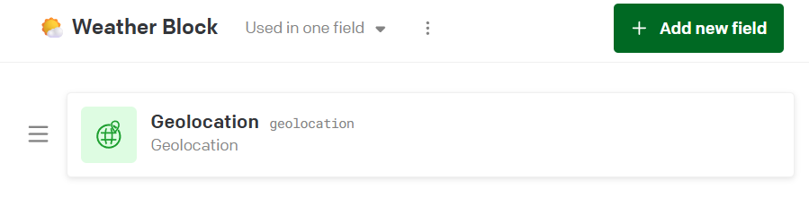
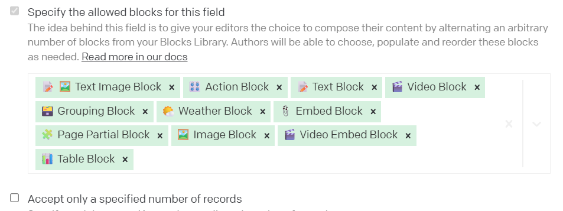

# 🌤️ DatoCMS + Astro Weather Page

This project is a technical assessment. The goal was to create a `/weather` page using [DatoCMS](https://www.datocms.com/) as the headless CMS and [Astro](https://astro.build/) as the frontend framework using [Voorhoede Head Start template](https://github.com/voorhoede/head-start). The page includes a custom weather block component that displays real-time weather data.

---

## Steps

## 🛠 DatoCMS Setup

- Followed the [Getting Started](https://github.com/voorhoede/head-start/blob/main/docs/getting-started.md) doc to create a DatoCMS project along with the requested API tokens. After running the migrations and promoting the environment to primary I have copied the API tokens into the repository.
- Created a dynamic [/weather](https://weather-assignment.pages.dev/en/weather/) page using the predefined `Page` model.
- Created a **Weather Block** that includes a `Geolocation` field.

- To be able to use it I have added the new block inside the Page model Body (inside the Validations). That allowed me to use it inside the created [/weather](https://weather-assignment.pages.dev/en/weather/) page and retrieve on the frontent the coordinates needed to retrieve on the frontend.

- Used a predefined **Action Block** on the Home page to route to the [/weather](https://weather-assignment.pages.dev/en/weather/) page.

## Frontend

- Created and added the `WeatherBlock` to the page `/weather` for displaying the data and inside I've created the `CitySearchForm.astro` component that allows the user to input the name of the city as well.
- The page displays both:
  - Weather data for preconfigured coordinates from DatoCMS.
  - Weather data for a city entered by the user.

- Created a static page [/weather-data](https://weather-assignment.pages.dev/en/weather-data?query=amsterdam) to show the weather data results using the `WeatherResults.astro` component which uses the geographic coordinates and sends them as query to the [Open-Meteo API](https://open-meteo.com/en/docs) and returns the current weather data.
- In the case the user chose to use the input field with the city name, for me to be able to retrieve the latitude and longitude I have used the [Nominatim search engine](https://nominatim.openstreetmap.org/ui/search.html) to convert the city name into the coordinates.

## Deployment

- Followed the deployment steps from the [Head Start docs](https://github.com/voorhoede/head-start/blob/main/docs/getting-started.md).
- Deployed to **Cloudflare Pages** using the [`feat/weather-block`](https://github.com/milailijevic/weather-assignment/tree/feat/weather-block) branch as the production branch (instead of `main`).

## 🔗 Live Demo

👉  [Cloudflare domain - weather-assignment](https://weather-assignment.pages.dev/en/)
